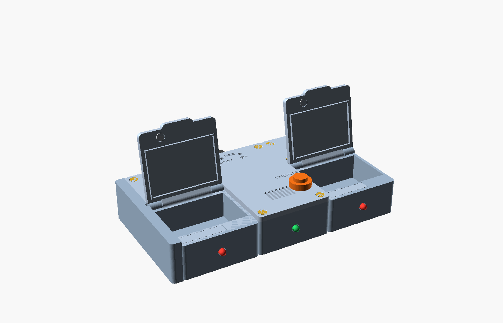
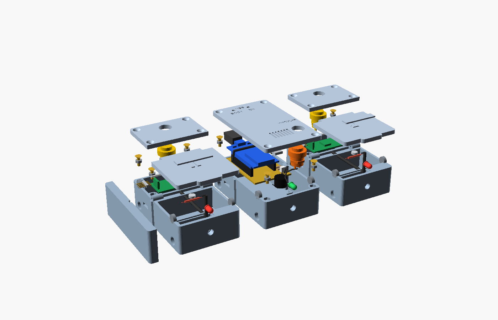
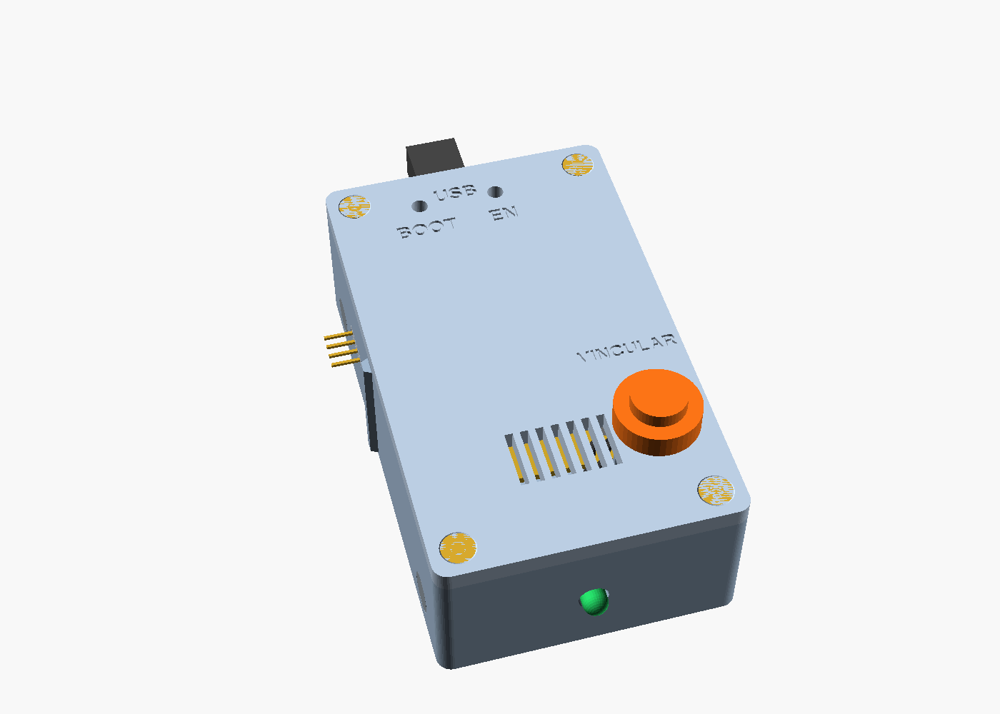
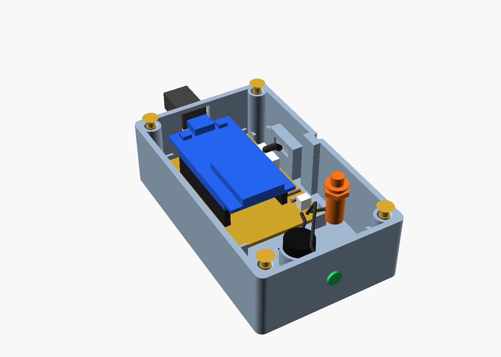
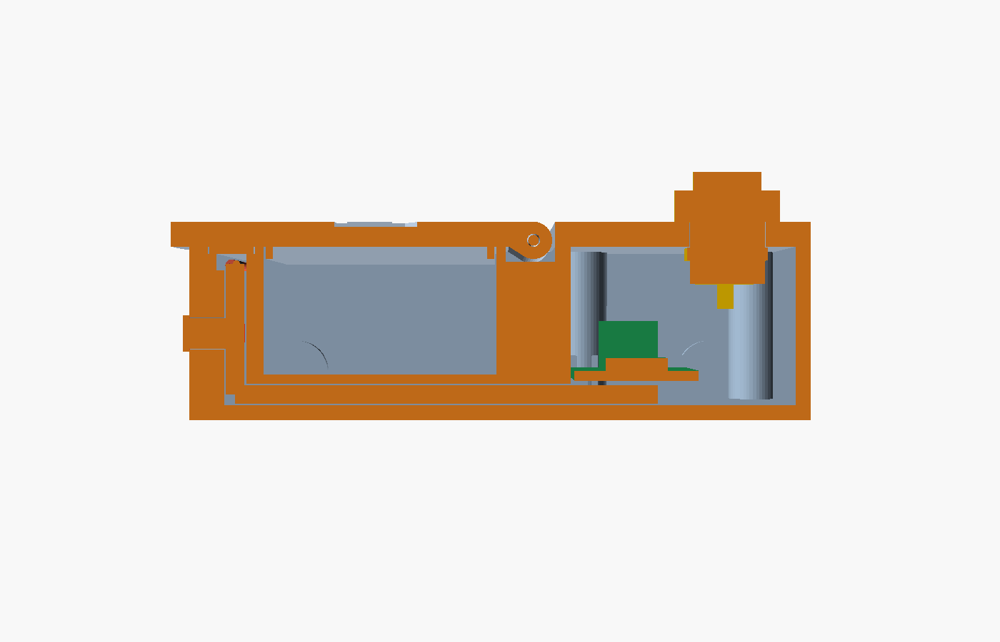
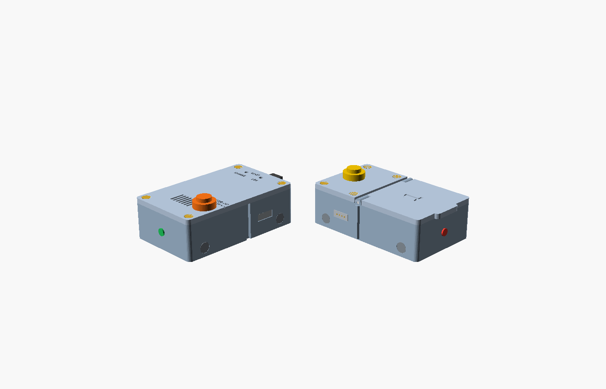
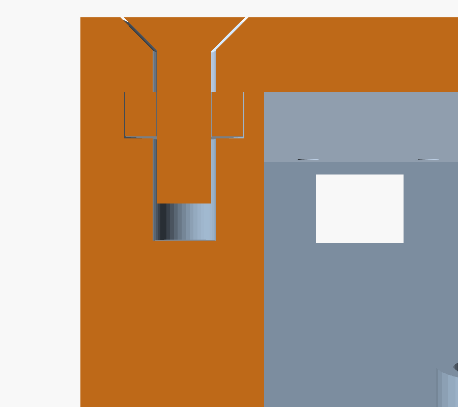

# Carcasa del pastillero

Modelos paramétricos en [OpenSCAD](https://openscad.org) (gratis). El pastillero es una fila de unidades del mismo
tamaño: la **base con el ESP32** a la izquierda y un **módulo por medicamento** a su derecha. Las unidades se unen
de lado con imanes y un conector magnético lleva el bus de una a otra, así que se añaden o quitan sin abrir nada.



## Medidas generales

| | |
|---|---|
| Cada unidad (base o módulo), con la tapa | 60 × 100 × 32 mm |
| Pastillero con 2 módulos (uno a cada lado de la base) | 188 × 100 × 32 mm, con la tapa lateral de 8 mm |
| Cámara de pastillas de cada módulo | 55 × 36 × 21 mm, unos 41 cm³ |
| Bahía de la electrónica de cada módulo | 55 × 36 × 26 mm |
| Paredes y fondo | 2,4 mm |
| Tapas (todas iguales y a ras) | 4 mm |
| LED del frente (todas las unidades) | Ø 5 mm a 14 mm de altura |
| Unión (cada cara lateral) | Conector magnético de 4 pines a 72 mm del frente y 14 de altura, 2 imanes de 8 × 3 mm |
| Holgura entre piezas que encajan | 0,3 mm |

Ejes de los modelos: `x` es el ancho (hacia la derecha), `y` el fondo (el frente está en `y = 0`) y `z` el alto.

## Qué va en cada sitio



### Base del ESP32



| Componente | Dónde va | Cómo se sujeta |
|---|---|---|
| Placa perforada 40 × 60 mm | Atrás, en el fondo | 4 postes de 3 mm con escuadras (y cinta de doble cara) |
| ESP32 DevKit de 30 pines con USB-C (52,5 × 28 mm) | Sobre la placa perforada, con el USB contra la pared trasera y la antena hacia el frente | Enchufado en dos tiras de zócalo hembra: se puede sacar |
| Transistor NPN, resistencias de 220 Ω y 1 kΩ y conector JST-XH de 4 pines | Franja derecha de la placa perforada (9 mm) | Soldados a la placa; del JST salen 4 cables al conector magnético de la cara derecha |
| Buzzer activo de 12 × 9 mm | Delante, en el fondo | Encajado en un anillo, apoyado en un escalón a 3 mm del fondo; sus patas salen por debajo, por una ranura del anillo, hacia la placa perforada |
| LED de estado de 5 mm, verde | Frente, a 14 mm de altura | Entra desde fuera con las patas primero hasta que la pestaña hace tope en un escalón; asoma 3,5 mm y se fija con una gota de pegamento |
| **Botón de vinculación** (pulsador de panel de 12 mm, el mismo de los módulos) | En la tapa, a 49 mm del lado izquierdo y 24 mm del frente | Con su tuerca por debajo; es duro y hay que mantenerlo 5 s, así que no se activa sin querer |
| Cable USB-C | Pared trasera | Abertura de 13 × 10 mm |

La tapa lleva la rejilla del buzzer, el botón de vinculación con el rótulo **VINCULAR**, los
agujeros para pulsar EN y BOOT con un clip y el rótulo **USB** junto a la salida del cable. Con el USB hacia atrás,
BOOT queda a la izquierda y EN a la derecha (comprobado en las fotos de la placa).



#### Conexiones de la base

Son las del firmware `esp32_pillbox`. El bus I2C usa los pines por defecto del ESP32.

| Pin del ESP32 | Va a | Detalle |
|---|---|---|
| GPIO 18 | LED de estado | Ánodo por una resistencia de 220 Ω; cátodo a GND. Parpadea mientras espera la vinculación |
| GPIO 27 | Botón de vinculación | El otro borne a GND (pull-up interno). **Mantenerlo 5 s** borra el Wi-Fi y vuelve al modo de vinculación con la app |
| GPIO 23 | Buzzer | Por una resistencia de 1 kΩ a la base de un NPN (2N2222 o S8050); el buzzer entre 5 V (VIN) y el colector |
| GPIO 21 (SDA), GPIO 22 (SCL) | Conector del bus | Por el JST de la placa perforada al conector magnético hembra de la cara derecha |
| 3V3 y GND | Conector del bus | Alimentan los módulos; las resistencias de pull-up del bus van una sola vez, en la base |

### Cada módulo

| Componente | Dónde va | Cómo se sujeta |
|---|---|---|
| LED de 5 mm, rojo | Frente, a 14 mm de altura | Entra desde fuera con las patas primero hasta que la pestaña hace tope en un escalón; asoma 3,5 mm, sus patas quedan en el pozo y se fija con una gota de pegamento |
| Reed (cuerpo de 14 × 2 mm) | Canal abierto del borde del sensor, pegado al frente | Se echa dentro desde arriba; la tapita lo cubre |
| Imán de neodimio 6 × 2 mm | Bajo la tapa, justo encima del reed | Pegado con cianoacrilato; la polaridad da igual |
| Cable del reed y del LED | Un mazo de 4 hilos | Por el carril del canal, el pozo y el canal recto hasta la bahía |
| Placa PCF8574 (40 × 20 mm) | Fondo de la bahía, con los conectores del bus hacia los lados | 4 postes de 4 mm con escuadras |
| Pulsador de panel de 12 mm (bisel Ø 17, 8 mm por encima y 10 mm por dentro) | En la cubierta de la bahía | Con su tuerca por debajo |
| Pasador de la bisagra | Entra por la izquierda y atraviesa los tres nudillos | Filamento de 1,75 mm; el agujero es ciego a la derecha y la unidad de la izquierda impide que se salga |

**Un solo canal para los cables.** El borde del sensor ocupa todo el ancho del módulo, al frente. Arriba tiene un canal
abierto de 4,8 × 3,8 mm que va solo del reed al pozo (30,5 mm), con 5 mm libres junto al vidrio para doblar las patas: el reed se echa dentro desde arriba, junto al frente, y sus cables corren por el
carril de atrás hasta un pozo. El LED entra por la pared del frente y también asoma al pozo. Los cuatro hilos bajan
juntos y siguen **un único canal recto de 12 × 3,5 mm** bajo el fondo de la cámara hasta la bahía, así que las pastillas
nunca tocan un cable y no hay que enhebrar nada por huecos estrechos.

La **tapita del sensor** (32,9 × 7,2 × 1,2 mm) cubre el canal entero y apoya 1,2 mm por los cuatro lados, a ras. No interfiere con el imán: añade
1,2 mm de plástico entre el imán y el reed, que quedan a 1,8 mm. La tapa cerrada la mantiene en su sitio y, con la tapa
abierta, se saca con la uña. La tapa se queda abierta a unos 100° apoyada en el borde de la cubierta, sin llegar a tocar
el pulsador.

Si se cambia la posición del reed (`REED_X`), el imán, el canal y la tapita se mueven con él.



### Entre unidades: imanes y tira de pines



Cada cara lateral lleva lo mismo y a la misma altura en todas las unidades, así que cualquier unidad encaja a cada lado
de cualquier otra. El pastillero va así: **módulo 1, base, módulo 2**, con la **tapa lateral** en el extremo izquierdo.

| | Cara izquierda (base y módulos) | Cara derecha (base y módulos) |
|---|---|---|
| Tira de pines de 2,54 mm, 4 pines (3,3 V, GND, SDA, SCL) | **Macho**: el plástico dentro de la pared, los pines sobresalen 6 mm | **Hembra** (11 × 2,5 × 8,5 mm), a ras de la pared |
| Imanes de disco 8 × 3 mm | 2, a ras | 2, a ras |
| Guía vertical | Saliente de 1,5 mm | Canal |

- **Cableado dentro de cada módulo:** tira macho de la izquierda → entrada de la PCF8574; salida de la PCF8574 →
  tira hembra de la derecha. En la base, las dos tiras van al JST de la placa perforada (la de la izquierda por encima
  del ESP32).
- **Polaridad de los imanes:** pega primero los de las caras izquierdas, todos con la misma cara hacia fuera. Para
  cada imán de una cara derecha (y de la tapa lateral), ponlo sobre uno de una cara izquierda: la cara que queda pegada
  es la que va hacia fuera.
- **Montaje:** con todo apagado, acerca cada unidad de frente a la de su lado. La guía entra en su canal, los pines del
  macho entran en la hembra y los imanes las sujetan. Para separarlas, tira de lado sin torcer, para no doblar los pines.
- **Tapa lateral:** se pega con 2 imanes a la cara izquierda del módulo del extremo. Tapa los pines macho, que llevan
  corriente, y la entrada del pasador de su bisagra. La hembra del extremo derecho queda a ras y no necesita tapa.
- La tira macho tiene medidas típicas (2,5 mm de plástico, 6 mm de pin por fuera y 3 por dentro): ajusta `MACHO_*` en
  `comun.scad` a la tuya.

## Medidas de cada componente

Lo que dibuja el modelo, el hueco que le da la caja y qué conviene medir en la pieza real. Las marcadas como
*supuestas* son medidas típicas que hay que confirmar con la tuya; se corrigen en los parámetros de los `.scad`.
La tabla se genera con `visor/exportar.py` a partir de `visor/componentes.json`: edita ese archivo, no la tabla.

<!-- medidas:inicio -->
| Pieza | Medidas del modelo | Hueco en la caja | Compáralo con el real |
|---|---|---|---|
| Caja de la base | Exterior: 60 × 100 × 28 mm (sin tapa)<br>Interior: 55,2 × 95,2 × 25,6 mm<br>Paredes y fondo: 2,4 mm<br>Abertura del USB: 13 × 10 mm, centrada a 21,2 mm de altura<br>Pilares de las esquinas: Ø 8,6 mm unidos a las dos paredes, con hueco hexagonal para una tuerca M3 | Cara izquierda: tira macho, 2 imanes y guía saliente: encaja un módulo a la izquierda<br>Cara derecha: tira hembra, 2 imanes y canal de la guía: encaja un módulo a la derecha | Tras imprimir: 60 × 100 mm con una tolerancia de ±0,3 mm. Comprueba que el enchufe USB entra por la abertura. |
| Tapa de la base | Tamaño: 60 × 100 × 4 mm<br>Agujeros EN y BOOT: Ø 3,4 mm, a ±8,2 mm del centro del ESP32 y a 4,1 mm del borde de la placa donde está el USB<br>Botón de vinculación: agujero Ø 12,2 mm a 49 mm del lado izquierdo y 24 mm del frente<br>Rejilla del buzzer: 7 ranuras de 1,6 × 12 mm, paso 3 mm<br>Rótulos: BOOT, EN, USB y VINCULAR, grabados 0,6 mm | Altura libre bajo la tapa: 5,2 mm sobre el módulo del ESP32 | Con el ESP32 puesto, pasa un clip por cada agujero: debe tocar el botón que lleva el mismo rótulo. |
| Placa perforada *(supuesta)* | Placa: 40 × 60 × 1,6 mm<br>Posición: del frente: de 35,1 a 95,1 mm; a lo ancho: centrada | Apoyos: 4 postes de 3 mm de alto con escuadras, holgura 0,3 mm<br>Franja libre a la derecha del ESP32: 8,5 mm (conector JST y transistor)<br>Espacio debajo: 3 mm, para las soldaduras | Mide tu placa: debe ser de 40 × 60 mm (el formato de 4 × 6 cm). Si es de otro tamaño, cambia PERF_A y PERF_L. |
| Zócalos hembra *(supuesta)* | Cada tira: 2,5 × 38,1 × 8,5 mm (15 pines, paso 2,54 mm)<br>Entre las dos tiras: 25,4 mm entre centros, igual que las filas del ESP32<br>Posición: el primer pin a 6,5 mm del borde de la antena del ESP32 | Alto sobre la placa perforada: 8,5 mm, y encima 2,5 mm del plástico de los pines del ESP32 | Usa tiras hembra de 8,5 mm de alto. Si las tuyas son más bajas o más altas, cambia ZOCALO. |
| ESP32 DevKit | Placa: 52,5 × 28 × 1,6 mm (medida en tus fotos, ±0,5 mm)<br>Módulo WROOM-32: 18 × 25,5 × 3,2 mm, con la antena en el borde del frente<br>Conector USB-C: 9 × 7,5 × 3,2 mm, sobresale 1,9 mm del borde<br>Pines: 2 filas de 15, paso 2,54 mm, a 25,4 mm entre filas; el primero a 6,5 mm del borde de la antena<br>Botones EN y BOOT: a ±8,2 mm del centro y a 4,1 mm del borde del USB; BOOT a la izquierda mirando desde el frente<br>Agujeros de la placa: 4 de unos Ø 3 mm en las esquinas (no se usan: la sujetan los zócalos)<br>Altura total sobre la perforada: 8,5 de zócalo + 2,5 de pines + 1,6 + 3,2 = 15,8 mm | Espacio al USB-C: 0,6 mm entre el conector y la pared trasera<br>Altura libre sobre el módulo: 5,2 mm hasta la tapa | Medido en tus fotos sobre papel milimetrado. Confirma con un calibre el largo (52,5 mm), el ancho (28 mm) y la distancia entre filas de pines (25,4 mm). |
| Buzzer | Buzzer: Ø 12 × 9 mm sin las patas (medido)<br>Patas: salen por debajo, separadas unos 6,5 mm<br>Posición: centrado a 22 mm del frente, apoyado a 3 mm del fondo | Anillo: Ø interior 12,4 mm, exterior 14,8 mm, 8 mm de alto<br>Escalón: a 3 mm del fondo: el buzzer apoya en él y debajo quedan 3 mm para doblar las patas<br>Ranura de las patas: 9 × 3 mm en el anillo, mirando hacia la placa perforada<br>Altura libre sobre el buzzer: 13,6 mm hasta la tapa, bajo la rejilla | Dobla las patas 90° hacia atrás antes de encajarlo, para que salgan por la ranura. Suelda un cable a cada pata o llévalas directas a la placa perforada. |
| LED de estado | LED: Ø 5 mm, 8,6 mm de largo con la cúpula, pestaña de Ø 5,8 × 1 mm con un lado plano (cátodo)<br>Patas: la larga es el ánodo (+), la corta el cátodo (−)<br>Asoma: 3,5 mm por el frente, a 14 mm del fondo y centrado<br>Color: verde | Agujero: Ø 6 mm desde el frente: pasa la pestaña<br>Escalón: a 5,1 mm de profundidad, Ø 4 mm: detiene la pestaña y deja pasar las patas<br>Patas: salen por detrás del soporte, hacia la placa perforada | Si es un verde brillante (unos 3 V), con 220 Ω casi no se verá: pruébalo antes y, si se ve tenue, usa 68–100 Ω. |
| Conector del bus y transistor *(supuesta)* | JST-XH de 4 pines: 5,8 × 12,4 × 7 mm, a 72 mm del frente<br>Transistor: 4,6 × 3,6 × 5 mm, a 42 mm del frente | Franja de la perforada: a la derecha del ESP32: 8,5 mm<br>Cables al conector magnético: 4 hilos de unos 40 mm | Mide tu JST-XH (suele ser 5,75 × 12,4 mm con 4 pines) y comprueba que el transistor sea un TO-92. |
| Cable USB *(supuesta)* | Enchufe USB-C: 11 × 8 mm de cuerpo en el modelo, 18 mm de largo | Abertura: 13 × 10 mm<br>Holgura: 1 mm a cada lado y 1 mm en vertical<br>Hasta el conector: 2,4 mm de pared y 0,6 mm de aire | Mide el cuerpo del enchufe USB-C de tu cable: los comunes miden unos 12 × 6,5 mm y entran por la abertura hasta el conector. |
| Tornillos de la tapa | Tornillo: M3 × 10 mm de cabeza avellanada (DIN 7991), cabeza Ø 6,5 mm<br>Posiciones: 4 esquinas, a 5,6 mm de los bordes exteriores | Paso en la tapa: Ø 3,4 mm con avellanado de Ø 6,9 mm: la cabeza queda a ras<br>Reparto de la longitud: 4 mm en la tapa, 2,4 en la tuerca y 3,6 de punta en el agujero del pilar | Si usas M3 × 8, también vale: la rosca atraviesa la tuerca entera. |
| Tuercas de la base | Tuerca: M3 hexagonal normal (DIN 934): 5,5 mm entre caras y 2,4 mm de grosor | Pilar: Ø 8,6 mm unido a las dos paredes, sin huecos en la esquina<br>Hueco hexagonal: 5,6 mm entre caras y 2,5 mm de fondo, en lo alto del pilar: la tuerca entra a presión y queda a ras<br>Debajo: agujero de Ø 3,4 mm para la punta del tornillo<br>Pared alrededor: 1,1 mm hacia el interior y 2,4 mm hacia la cara exterior de la caja | Mete la tuerca con una gota de epoxi (tipo Pegadit o Araldite), sin manchar la rosca, y deja secar antes de atornillar. No aprietes de más: el tornillo tira de la tuerca hacia la tapa. |
| Base del módulo | Exterior: 60 × 100 × 28 mm; 32 mm con los nudillos de la bisagra; +1,5 mm de guía en la cara izquierda<br>Cámara de pastillas: 55,2 × 36,4 mm, 20,6 mm de profundidad (≈ 41 cm³)<br>Borde del sensor: a todo el ancho (60 mm), 12 mm de fondo, al frente<br>Bahía de la electrónica: 55,2 × 36,2 × 25,6 mm<br>Bloque divisor: 12 mm; bisagra a 55,4 mm del frente | Canal abierto del sensor: 30,5 × 4,8 × 3,8 mm, solo del reed al pozo, desde 4,4 mm del frente<br>Rebaje de la tapita: 33,2 × 7,5 mm, 1,2 mm de profundidad, a ras de lo alto del borde<br>Pozo: 8 × 3,6 mm, baja del canal al fondo<br>Canal recto de cables: 12 × 3,5 mm, del pozo a la bahía (unos 57 mm), bajo el fondo de la cámara<br>Fondo de la cámara: elevado a 7,4 mm | Tras imprimir: 60 × 100 mm (±0,3 mm). Pasa un cable de 4 hilos por el canal recto: debe correr sin forzar. Prueba la guía y el canal de la unión con otra unidad. |
| Tapa del módulo | Placa: 60 × 61,4 × 4,5 mm<br>Reborde: 2 mm de alto, entra en la cámara (detrás del borde del sensor) con 0,3 mm de holgura<br>Lengüeta: 24 mm de ancho, sale 3 mm<br>Número grabado: 0,8 mm de profundidad | Alojamiento del imán: Ø 6,5 × 2,3 mm abierto por debajo, a 16 mm del lado izquierdo y a 5,6 mm del frente; 1,7 mm de piel arriba<br>Bisagra: eje Ø 2,1 mm | Con la tapa cerrada debe quedar a ras de la cubierta, y abierta unos 100° sin tocar el pulsador. |
| Cubierta de la bahía | Tamaño: 60 × 41,1 × 4 mm<br>Agujero del pulsador: Ø 12,2 mm, a 11 mm del borde trasero<br>Agujeros de tornillo: 4 de Ø 3,4 mm con avellanado de Ø 6,9 mm para M3 | Bahía que cierra: 55,2 × 36,2 mm | Debe quedar a ras de la tapa, con 0,4 mm de junta. |
| Pasador de la bisagra | Pasador: Ø 1,75 × 58 mm | Agujero: Ø 2,1 mm, ciego: termina a 1,5 mm de la cara derecha<br>Eje de la bisagra: a 55,4 mm del frente y 29 mm de altura | Filamento de 1,75 mm (±0,05). Si no entra con holgura, abre el agujero a Ø 2,2 mm (PASADOR). |
| Imán de la tapa | Imán: disco Ø 6 × 2 mm (medido), a 16 mm del lado izquierdo y a 5,6 mm del frente, justo encima del reed | Alojamiento: Ø 6,5 × 2,3 mm; quedan 1,7 mm de tapa por encima<br>Distancia al reed: 1,8 mm con la tapa cerrada (la tapita de 1,2 mm queda en medio) | Antes de imprimir, acerca el imán al reed con 1,8 mm de plástico en medio y mide con un tester que cierra. Si no, usa uno de 8 × 3 mm o baja la tapita a 1 mm. |
| Reed | Cuerpo de vidrio: 14 × 2 mm (medido)<br>Patas: salen por los extremos; se doblan a más de 2 mm del vidrio<br>Posición: centro a 16 mm del lado izquierdo, pegado al frente del canal (5,6 mm del frente) | Canal abierto: 30,5 × 4,8 × 3,8 mm, del reed al pozo; si cambias REED_X, el canal y la tapita se mueven con él<br>Margen para doblar las patas: 5 mm de canal libre a la izquierda del vidrio y 3 mm a la derecha antes del pozo<br>Carril de los cables: 2,6 mm detrás del reed, dentro del mismo canal<br>Distancia a la tapita: 0,6 mm | No dobles las patas pegadas al vidrio: sujétalas con unos alicates entre el vidrio y el doblez, porque el vidrio se raja con facilidad. |
| LED del módulo | LED: Ø 5 mm, 8,6 mm de largo con la cúpula, pestaña de Ø 5,8 × 1 mm con un lado plano (cátodo)<br>Patas: la larga es el ánodo (+), la corta el cátodo (−)<br>Asoma: 3,5 mm por el frente, a 14 mm del fondo y centrado<br>Color: rojo | Agujero: Ø 6 mm desde el frente: pasa la pestaña<br>Escalón: a 5,1 mm de profundidad, Ø 4 mm: detiene la pestaña y deja pasar las patas<br>Patas: salen al pozo y bajan con los cables del reed | Mételo desde fuera con las patas primero hasta que la pestaña haga tope, y fíjalo con una gota de pegamento por dentro. Con 220 Ω a 3,3 V se ve bien. |
| Placa PCF8574 *(supuesta)* | Placa: 40 × 20 × 1,6 mm<br>Chip: 8 × 10 × 2 mm<br>Conectores del bus: 2 × 10 × 8 mm, en los extremos largos | Alojamiento: 40,6 × 20,6 mm (holgura 0,3 mm)<br>Apoyos: 4 postes de 4 mm de alto con escuadras<br>Altura libre sobre la placa: 20 mm hasta la cubierta<br>Bahía: 55,2 × 36,2 mm: sobran 14 mm de ancho y 15 de fondo | Mide tu placa PCF8574: largo, ancho y dónde quedan los conectores. Las comunes miden entre 35 y 40 mm de largo. |
| Pulsador | Pulsador: de panel de 12 mm, normalmente abierto (tipo PBS-33B, medido)<br>Por encima de la tapa: 8 mm: bisel negro de Ø 17 mm y cúpula<br>Rosca: Ø 12 × 10 mm (M12), con tuerca<br>Terminales: 2, de 4 mm, por debajo de la rosca<br>Por dentro de la caja: 10 mm (6 de rosca + 4 de terminales) | Agujero: Ø 12,2 mm en la cubierta, a 11 mm del borde trasero<br>Rosca en la cubierta: 4 mm; quedan 6 mm por debajo para la tuerca<br>Debajo: llega a 18 mm del fondo, detrás de la placa PCF8574: no se tocan | Mide la tuerca (entre caras y grosor) y aprieta sin pasarte: la rosca es de plástico. |
| Tornillos de la cubierta | Tornillo: M3 × 10 mm de cabeza avellanada (DIN 7991), cabeza Ø 6,5 mm<br>Posiciones: 4 esquinas de la bahía | Paso en la tapa: Ø 3,4 mm con avellanado de Ø 6,9 mm: la cabeza queda a ras<br>Reparto de la longitud: 4 mm en la tapa, 2,4 en la tuerca y 3,6 de punta en el agujero del pilar | Si usas M3 × 8, también vale: la rosca atraviesa la tuerca entera. |
| Tuercas del módulo | Tuerca: M3 hexagonal normal (DIN 934): 5,5 mm entre caras y 2,4 mm de grosor | Pilar: Ø 8,6 mm unido a las dos paredes, sin huecos en la esquina<br>Hueco hexagonal: 5,6 mm entre caras y 2,5 mm de fondo, en lo alto del pilar: la tuerca entra a presión y queda a ras<br>Debajo: agujero de Ø 3,4 mm para la punta del tornillo<br>Pared alrededor: 1,1 mm hacia el interior y 2,4 mm hacia la cara exterior de la caja | Mete la tuerca con una gota de epoxi (tipo Pegadit o Araldite), sin manchar la rosca, y deja secar antes de atornillar. No aprietes de más: el tornillo tira de la tuerca hacia la tapa. |
| Tira de pines macho *(supuesta)* | Tira macho: 4 pines de 2,54 mm: plástico de 10,2 × 2,5 × 2,5 mm (medidas típicas)<br>Pines: 0,64 mm cuadrados: sobresalen 6 mm por fuera y 3 mm por dentro para soldar<br>Posición: cara izquierda, a 72 mm del frente y 14 mm de altura | Alojamiento: 10,6 × 2,9 × 2,5 mm: el plástico queda dentro de la pared<br>Por dentro: 4 mm libres detrás para soldar los cables | Mide cuánto sobresalen los pines por el lado largo (deberían ser unos 6 mm). Junta las unidades de frente, sin torcerlas, para no doblarlos. |
| Tira de pines hembra | Tira hembra: 4 pines de 2,54 mm, 11 × 2,5 × 8,5 mm (medida)<br>Posición: cara derecha, a ras, a 72 mm del frente y 14 mm de altura | Alojamiento: 11,4 × 2,9 × 8,5 mm<br>Por dentro: 4 mm libres detrás para soldar los cables | Córtala sacrificando un pin, como los zócalos, y pégala a ras con una gota de epoxi. Prueba con un tester que cada pin del macho vecino toca su contacto. |
| Tapa lateral | Tapa: 8 × 100 × 32 mm, con las esquinas redondeadas<br>Imanes: 2 de 8 × 3 mm, como una cara derecha | Pines: hueco de 11 × 3,3 × 6,5 mm para los pines macho del módulo del extremo<br>Guía: canal para la guía saliente de la cara izquierda | Se pega por imanes a la cara izquierda del módulo del extremo. Tapa los pines, que llevan corriente, y la entrada del pasador de la bisagra. |
| Imanes de la cara izquierda | Imán: disco Ø 8 × 3 mm (medido)<br>Posiciones: 2 por cara: a 14 y a 87 mm del frente, a 7 mm de altura | Alojamiento: Ø 8,3 × 3,2 mm, a ras de la cara | Con los 2 pares de imanes las unidades deben sostenerse sin moverse, pero poder separarse tirando con la mano. |
| Imanes de la cara derecha | Imán: disco Ø 8 × 3 mm (medido)<br>Posiciones: 2 por cara: a 14 y a 87 mm del frente, a 7 mm de altura | Alojamiento: Ø 8,3 × 3,2 mm, a ras de la cara | Antes de pegarlos, ponlos sobre un imán de una cara izquierda: la cara que queda pegada es la que va hacia fuera. |
<!-- medidas:fin -->

## Archivos

| Archivo | Qué contiene |
|---|---|
| `comun.scad` | Medidas compartidas por todas las unidades (cambiarlas aquí cambia todas) |
| `base_esp32.scad` | Caja y tapa de la base, y sus componentes para el montaje |
| `modulo.scad` | Base, tapa y cubierta del módulo, y sus componentes para el montaje |
| `montaje.scad` | El pastillero completo: `vista = "fila"`, `"abierta"`, `"explotada"` o `"corte"` |
| `stl/` | Piezas listas para el laminador |
| `vistas/` | Imágenes del montaje |

Para volver a exportar una pieza: abrir el archivo en OpenSCAD, elegir `parte`, `Render (F6)` y `Export as STL`.

## Vista 3D y comprobaciones

En `visor/` están las herramientas que generan los STL, comprueban el diseño y arman una vista 3D interactiva con cada
pieza señalada. Necesitan Python 3 y OpenSCAD (se busca en la variable `OPENSCAD`, en la ruta de Windows o en el PATH).
Conviene una versión reciente de OpenSCAD (2024 o posterior, por ejemplo la *Nightly*): los scripts usan su motor
Manifold y reparten el trabajo entre los núcleos del procesador, y la comprobación completa tarda unos 10 s en lugar de
unos 20 minutos con la 2021.

```bash
python visor/comprobar.py
```

Exporta las piezas a `stl/`, comprueba que sean sólidos válidos y que ninguna pieza ni componente se pise con otro.

```bash
python visor/exportar.py
```

Exporta cada pieza y componente por separado y arma `visor/carcasa.html` a partir de `visor/plantilla.html`: una
sola página, con los modelos dentro, que usa three.js para girar el pastillero, abrir las tapas, desarmarlo y ver
por dentro. Los textos de la leyenda y de las señales están en las listas `ITEMS` y `ZONAS` de la plantilla.

## Qué se imprime

| Pieza | Cantidad | Cómo se imprime | Archivo |
|---|---|---|---|
| Caja de la base | 1 | Tal cual, con el fondo en la cama | `stl/base_caja.stl` |
| Tapa de la base | 1 | Plana, con los rótulos hacia arriba | `stl/base_tapa.stl` |
| Base del módulo | 2 | Tal cual, con el fondo en la cama | `stl/modulo_base.stl` |
| Tapa del módulo 1 y del 2 | 1 + 1 | Boca abajo: el número contra la cama y el reborde hacia arriba | `stl/modulo_tapa_1.stl`, `stl/modulo_tapa_2.stl` |
| Cubierta de la bahía | 2 | Plana | `stl/modulo_cubierta.stl` |
| Tapa lateral | 1 | Con la cara exterior en la cama | `stl/modulo_tapa_lateral.stl` |
| Tapita del sensor | 2 | Plana | `stl/modulo_tapita.stl` |

PETG o PLA, capa de 0,2 mm, 3 perímetros, relleno 20 % y **sin soportes**. Las piezas ya están orientadas así en los STL.

Tornillería: 12 tornillos M3 × 10 de cabeza avellanada (DIN 7991) y 12 tuercas M3 normales (DIN 934), 4 por unidad.
Cada tuerca se mete desde arriba en el hueco hexagonal de lo alto de su pilar, a presión y a ras, con una gota de epoxi
(tipo Pegadit o Araldite) sin manchar la rosca. Deja secar antes de atornillar y no aprietes de más, porque el tornillo
tira de la tuerca hacia la tapa.

Los pilares de las esquinas miden Ø 8,6 mm y están unidos a las dos paredes, así que no quedan huecos en la esquina.
Cada uno tiene arriba el hueco de la tuerca (5,6 mm entre caras y 2,5 mm de fondo) y debajo un paso de Ø 3,4 mm para la
punta del tornillo.



Para la unión, con la base y 2 módulos: 3 tiras macho y 3 tiras hembra de 4 pines de 2,54 mm (una de cada por unidad) y
14 imanes de 8 × 3 mm (2 por cara lateral de cada unidad y 2 para la tapa lateral).

Imprime primero **una sola base de módulo con su tapa** y comprueba con las piezas reales la placa PCF8574,
el reed, el imán y la bisagra antes de imprimir el resto.

## Pendiente hasta tener las piezas

Decidido, pero se modela cuando estén las piezas reales para medirlas:

- **Tuercas M3:** se usan tuercas normales en lugar de insertos. Si las tuyas no son de 5,5 × 2,4 mm, ajusta
  `TUERCA_E` y `TUERCA_H` en `comun.scad`.
- **Botón de la base (GPIO 27):** vincular manteniéndolo 5 s; falta decidir si también silencia la alarma en la
  versión con módulos, y confirmar la rosca del pulsador (supuesto de 7 mm).
- **Medidas supuestas por confirmar:** placa PCF8574, pulsador de panel de los módulos, conector magnético de
  4 pines, reed, imanes y tiras de zócalo (ver la tabla de medidas).
